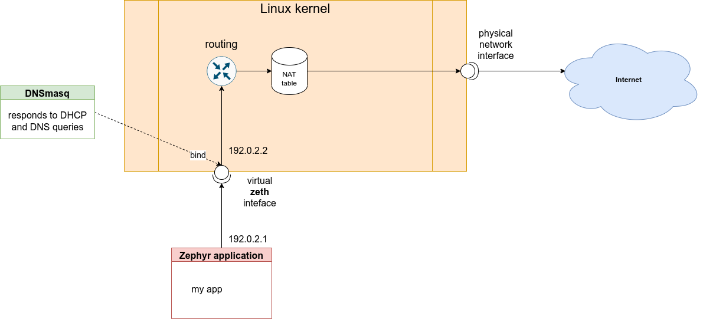

# Create NAT and routing for Zephyr native network on Linux

This page describes how you can set up a networking rules that allows you to run Zephyr applications
build to native_posix or QEMU targets and get them to access public Internet.




Zephyr applications, when build on native_posix or various qemu targets,
run simulated Ethernet driver that attaches itself to a network interface called zeth.
This is Linux TAP interface so it can send and receive Ethernet frames.

In order to have networking with Zephyr, you need to configure IP address on linux kernel side,
set up the routing and have NAT (Network Address Translation / IP masquerading) for outbound
traffic.

Optionally, having dnsmasq to serve as small stand-alone DHCP and DNS server helps.
When running dnsmasq, it must bind into the zeth interface, so it does not serve any
requests coming from outside network.

## Building the Zephyr application for native networking

At minimun, you need following Kconfig settings for your *native_posix* application to have
working network

```
# General network requirements
CONFIG_NETWORKING=y
CONFIG_NET_IPV4=y
CONFIG_NET_TCP=y
CONFIG_NET_UDP=y
CONFIG_NET_SOCKETS=y

# Native posix requirements
CONFIG_ENTROPY_GENERATOR=y
CONFIG_TEST_RANDOM_GENERATOR=y

CONFIG_NET_L2_ETHERNET=y
CONFIG_ETH_NATIVE_POSIX=y
CONFIG_ETH_NATIVE_POSIX_RANDOM_MAC=y

# IPv4 config
CONFIG_NET_CONFIG_SETTINGS=y
CONFIG_NET_CONFIG_NEED_IPV4=y
CONFIG_NET_CONFIG_MY_IPV4_ADDR="192.0.2.1"
CONFIG_NET_CONFIG_MY_IPV4_GW="192.0.2.2"
CONFIG_DNS_RESOLVER=y
CONFIG_DNS_RESOLVER_MAX_SERVERS=1
CONFIG_DNS_SERVER_IP_ADDRESSES=y
CONFIG_DNS_SERVER1="192.0.2.2"
```

## Running the native_posix app

You can test your configuration for example in `zephyr/samples/net/sockets/http_get` by creating
a file called `boards/native_posix.conf` with the content from the sample above.

```sh
cd zephyr/samples/net/sockets/http_get
# create boards/native_posix.conf

# Building the application
west build -b native_posix -- -DOVERLAY_CONFIG=overlay-tls.conf

# Run the application
# Note that you need to run it realtime (-rt) so responses don't timeout,
# otherwise it would run faster.
# Also any TLS/DTLS traffic needs proper seed or random generator,
# $RANDOM is adequate enough for testing purposes, not secure though,
./build/zephyr/zephyr.elf -rt -seed=$RANDOM

# Run application that use shell, for example lwm2m_client
# These spawn the shell and logs into a virtual serial port on /dev/pts/X
# it is easier to open a x-terminal to this serial port when you start the application
./build/zephyr/zephyr.elf -rt -seed=$RANDOM -attach_uart
```

You might need to supply also `-attach_uart_cmd` parameter, in case default X-terminal is not
installed. For example `-attach_uart_cmd='x-terminal-emulator -e screen %s &'` works.
